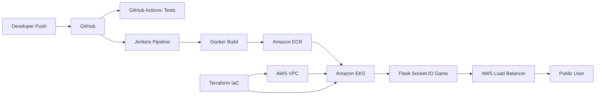

# Cloud-Native Self-Service Deployment Platform

Real-time multiplayer word guessing game deployed through a complete DevOps pipeline using Docker, GitHub Actions, Jenkins, Terraform, Kubernetes, AWS EKS, Prometheus and Grafana.

## Architecture

## Deployments

### GitHub Actions CI
docs/screenshots/github-actions-success.png

### Jenkins Pipeline
docs/screenshots/jenkins-pipeline-success.png

### Terraform Infrastructure
docs/screenshots/terraform-infrastructure.png

### EKS Nodes
docs/screenshots/eks-nodes-ready.png

### Kubernetes Workload
docs/screenshots/kubernetes-workload.png

### Live Application
docs/screenshots/live-application.png